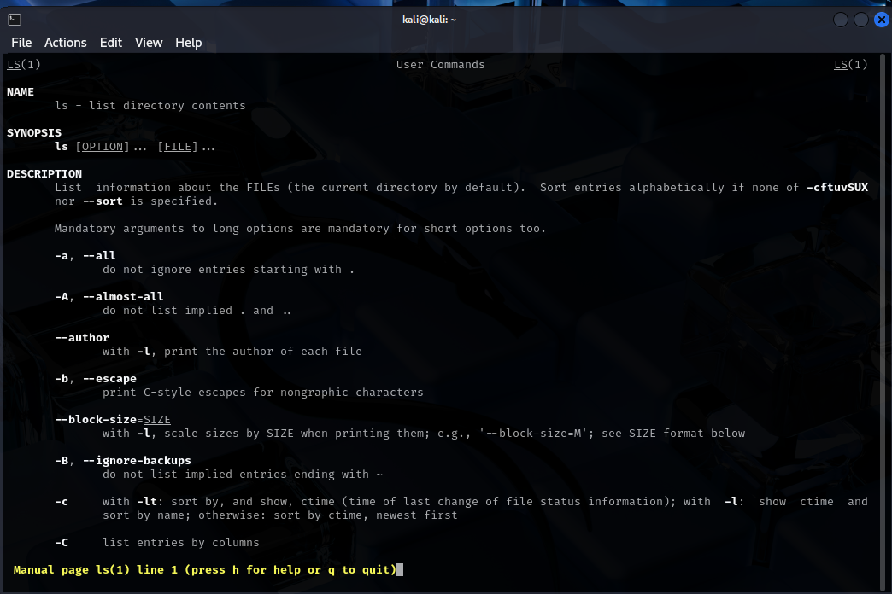
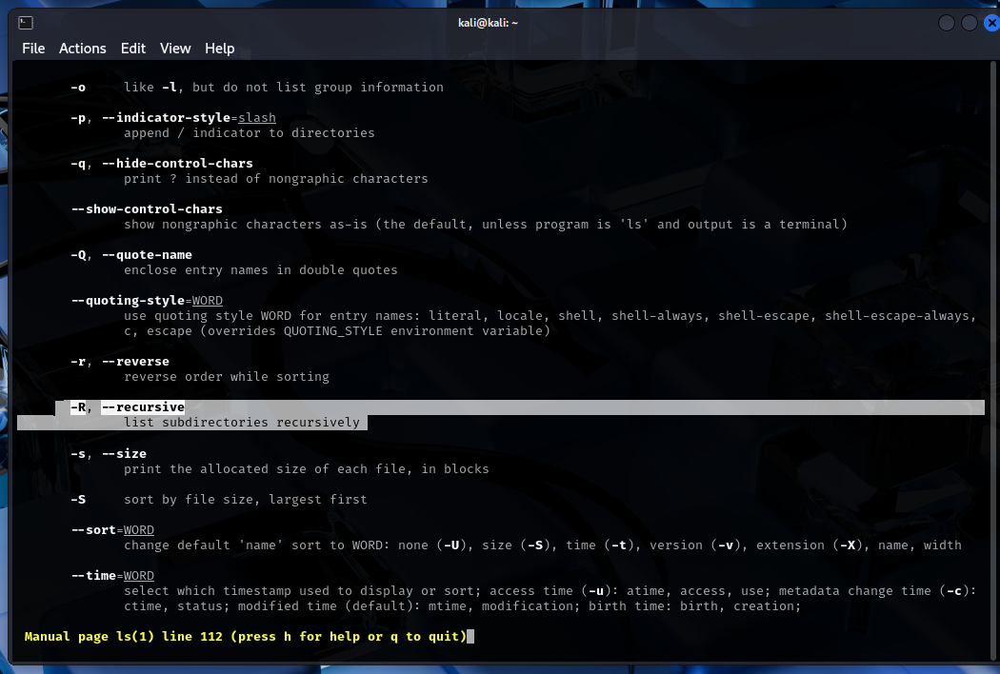
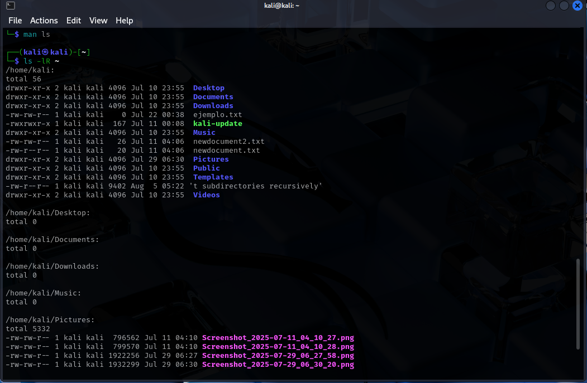
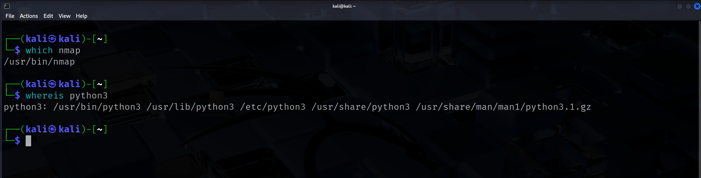
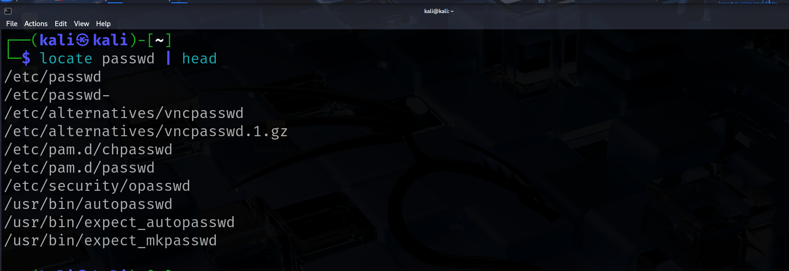
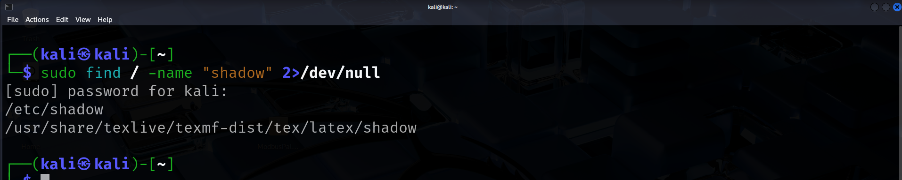

# linux-lab01-02-The-basic-Text-manipulation

# 🐧 Red Team Initial Access Lab: Linux Filesystem & Text Operations (Kali 2025)

## Real-World Scenario

You are an offensive security analyst at **ACME Cyber Defense**. You’ve been granted initial access to a Linux server (Kali 2025) for an audit. Your job is to document how you explore the system, identify key information, and safely manipulate files/text—demonstrating best pentesting practices.

---

## Objective

Show proficiency in Linux navigation, file/text handling, search, filtering, and documentation—skills essential for attackers, defenders, and auditors alike.

---

## Instructions

Read each requirement carefully. Complete every task using the terminal, providing your commands, outputs, and screenshots as evidence. Add brief comments where asked.

---

## 📝 Pentest Assignment Tasks

### 1. Environment & Session Recon

**Management wants you to confirm your access is under your controlled user (not root), and show your current working directory.**

- Display your current username and present working directory.

**Command(s):**
```bash
whoami
pwd
 ```


- Briefly explain why this information is critical during a pentest.
  
**Explanation:**
Knowing your current user is critical in a pentest because your permissions and access level depend on it. Knowing your present directory prevents mistakes like deleting files in the wrong location or running tools in the wrong folder.

## 2. Sensitive Files & Dotfiles Mapping

**The client wants to ensure there are no hidden files with credentials in the user’s home.**

- **List all files and folders (including hidden) in your home directory, showing permissions and dates.**

  **Command(s):**
  ```bash
  ls -al ~
  ```
**Explanation of the command ls -al ~:**
  
The command ls -al ~ is used to list all files and directories, including hidden ones, in your home directory. Here’s a breakdown:

ls — Lists files and directories in the specified location.

-a — Shows all files, including hidden ones (those starting with a dot.), which are often used to store configuration or sensitive data.

-l — Uses the long listing format, displaying detailed information such as permissions, number of links, owner, group, file size, and last modification date.

~ — Refers to the current user’s home directory.

Why is this important in pentesting?
Reviewing hidden files and detailed permissions helps you quickly spot files or folders that may contain credentials, SSH keys, private configurations, or artifacts from previous attacks. Attackers and defenders alike must master this command to properly enumerate and secure systems.


- Identify the most suspicious hidden file by its name and briefly justify your choice.
  
  .gnupg
(Hidden directories like .gnupg may store encryption keys or credentials, which are high-value targets for attackers.

- Show how you would restrict access to that file temporarily by changing its permissions.
  
  **Command(s):**
```bash
chmod 000 .gnupg
 ```

This command removes all permissions from the .gnupg directory, blocking access for any user, including the owner, until permissions are restored.
 

---

## 3. Manual Pages & Advanced Flags
 **The Blue Team asks how you’d recursively list all files in a directory and subdirectories.**
 
- Find out and document how to recursively list all files in a directory and its subdirectories using the `ls` command.
- Explain how you found the recursive flag, and provide an example command using your home directory.
- Attach a screenshot of the relevant flag/option as shown in the manual page.

#### Solution

**Step 1: Open the manual for ls**
I opened the manual with `man ls` and searched for "recursive" by typing `/recursive`. This highlighted the flag `-R, --recursive`, which allows listing all subdirectories recursively.
```bash
man ls
```
 
 


 **Command to list recursively in home:**
```bash
ls -lR ~
```
 


## 4. Tool Discovery & Location

- Find the absolute path to both `nmap` and `python3` using at least two different commands.
- Search the entire system for files named “passwd” or “shadow.”
- Briefly explain what risk is posed to a system if an attacker can access those files.

## Tool discovery: which vs whereis

**which**  
- Purpose: shows the path of the executable that would run for the current shell environment (searches your `PATH`).  
- Useful when you want to know *which* executable will be invoked by your shell.  
- Example:

  ```bash
    which nmap
  ```
**whereis**

- Purpose: searches for the binary, source and man page files for a program (looks in a broader set of standard locations).
- Useful when you want to quickly find the binary and documentation or source.
- Example:
  ```bash
  whereis phyton3
  ```
-**Summary:** use which to see the exact executable your shell will run; use whereis to find additional related files (man pages, source, libs).

 

 ## File search: locate vs find

**locate**

- Uses a pre-built database (mlocate database usually), so searches are very fast.
- The database must be up-to-date (updatedb), otherwise locate may not show very recent files.
- Good for quick searches on filenames when freshness is not critical.
- Example:

```bash
locate passwd | head
```



**find**

- Searches the filesystem in real time (walks directories).
- Slower on large filesystems but always current and flexible (can match names, times, sizes, owners, run actions). 
- Can restrict based on permissions, type, mtime, etc.
- Example:

```bash
sudo find / -name "passwd" 2>/dev/null
```

- Summary: use locate for quick filename lookup (fast, needs updated db); use find when you need an accurate, up-to-date search or complex filters.

  

---

## 5. Controlled File Handling & Manipulation

- Create a directory named `pentest_lab` and change into it.
- Inside that directory, create three files: `users.txt`, `hosts.txt`, and `secrets.txt`.
- Add at least three different lines of text to each file.
- In one command, display all lines from all files in the directory that contain the word `admin`.

---

## 6. Backup, Rename & Secure Deletion

- Create a backup of `users.txt` named `users.bak`.
- Rename `secrets.txt` to `.hidden_secrets`.
- Securely delete `hosts.txt` so it cannot be easily recovered.
- Demonstrate how you verify that `hosts.txt` has been deleted.

---

## 7. Information Extraction & Filtering

- Show only the lines in `users.txt` or `.hidden_secrets` that contain numbers.
- Count how many lines across all files in the directory contain the word `root`.
- Display both the total number of words and total number of lines in `users.txt` using different commands.

---

## 8. Text Processing & Automation

- Concatenate the contents of all `.txt` files and all hidden text files in the directory into a file named `full_report.txt`.
- Sort the contents of `full_report.txt` alphabetically and remove duplicate lines, saving the result to a new file.
- Show the first two and last two lines of the sorted, unique result file.

---

## 9. Final Challenge: Extraction & Advanced Analysis

- Search across all generated files for possible IP addresses, email addresses, or the words `password`/`passwd`.
- If you find credentials, explain in one sentence how you would handle this in a real engagement.

---


